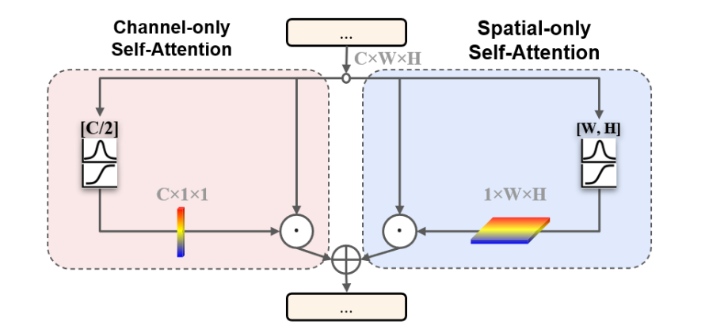
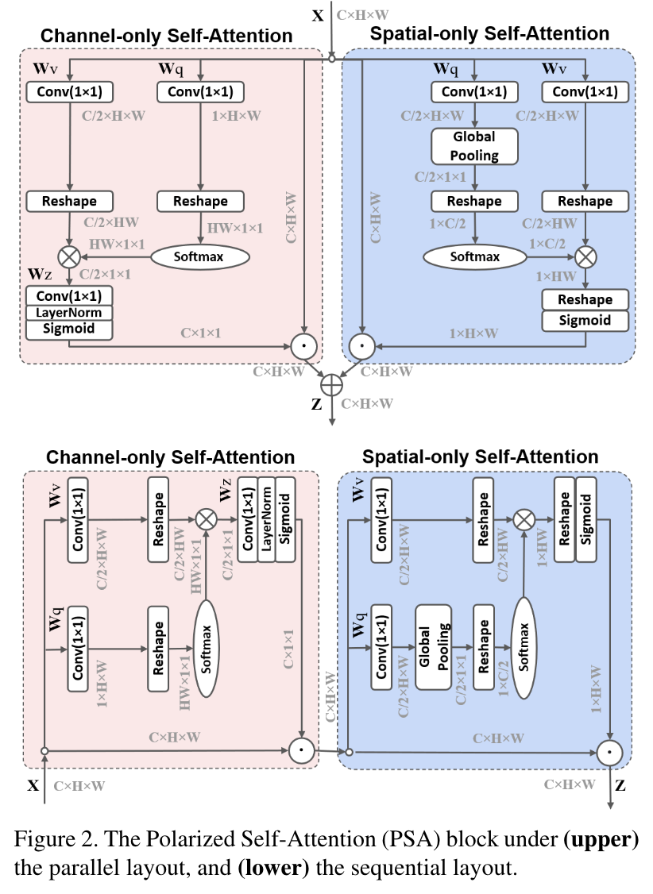
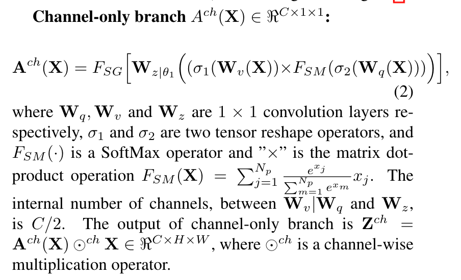
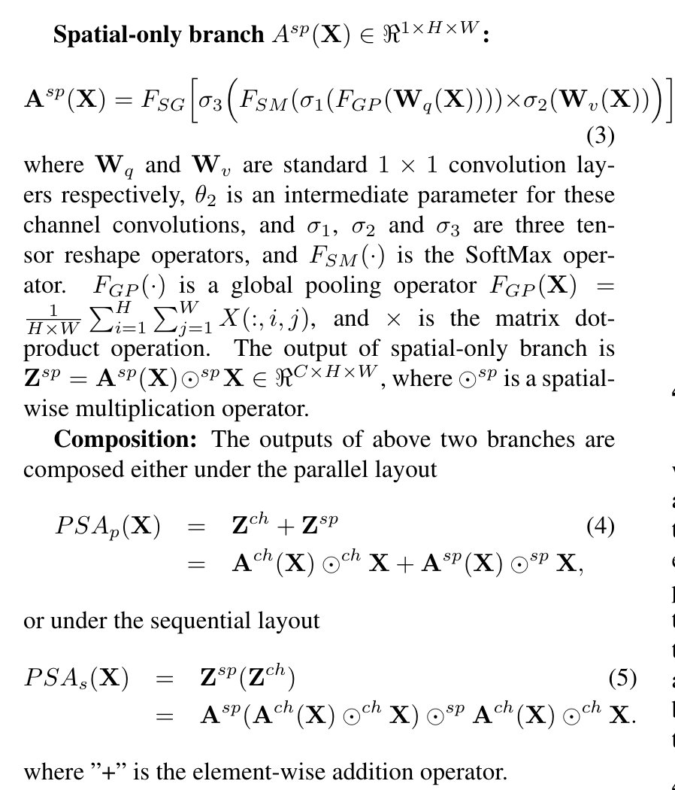

# Polarized Self-Attention: Towards High-quality Pixel-wise Regression

[Code](https://github.com/DeLightCMU/PSA)

## 1. 摘要

像素回归可能是细粒度计算机视觉任务中最常见的问题，如估计匹配关键点热图和分割掩膜。这些回归问题非常具有挑战性，特别是因为它们需要在较低的计算开销下，对高分辨率输入/输出的长程依赖性进行建模，以估计高度非线性的像素语义。虽然深卷积神经网络（DCNN）中的注意机制已成为增强长程依赖性、元素特定注意（如非局部块）的常用机制，这是一个高度复杂且对噪音敏感的学习过程，大多数简化的注意力混合体都试图在多种任务之间达成最佳折衷，我们提出了极化自我注意（PSA）模块，该模块结合了两个关键设计，以实现高质量像素回归：

(1) 极化滤波：在通道和空间注意力计算中保持高内部分辨率，同时完全折叠输入沿对应维度的张量。

(2) 增强：组合非线性直接拟合典型细粒度回归的输出分布，例如二维高斯分布（关键点热图）或二维二项分布（二进制分割掩码）。

## 2. 方法

在研究界和工业界，计算机视觉的任务从粗粒度到细粒度的转变趋势已经取得了进步。与粗粒度任务相比，像素级的感知越来越吸引人，如自动驾驶，增强现实，医疗图像处理和公共监视。

### 2.1 Self-Attention for Pixel-wise Regression

用于像素回归的DCNN沿两个维度学习特征的加权组合：(1)通道特定加权用以估计具体类别的输出分数; (2)空间特定权重，用于检测具有相同语义的像素。应用于DCNN的自注意机制有望进一步突出以上两个目标。

如何实现像素回归的通道特定权重和空间特定权重：

#### 2.1.1 Internal Attention Resolution

回想一下，大多数像素级回归DCNN使用相同的主干网络，如：ResNet，作为分类和坐标回归任务。为了鲁棒性和计算效率，这些backbone产生低分辨率的特征图。像素回归无法避免这种分辨率损失，特别是因为对象边缘和身体部位的高非线性很难在低分辨率特征中编码。

在像素回归中使用这些backbone，自注意块有望在注意力计算中保持高分辨率的语义。

#### 2.1.2 Output Distributions/Non-linearity

在逐像素回归的DCNN中，输出通常编码为三维张量，通过线性变换（如卷积）直接拟合分布的非线性可能会减轻DCNN的学习负担。然而，现有的Internal Attention Block都不包含这样的非线性函数组合。

### 2.2 Polarized Self-Attention (PSA) Block

​		为了解决上述的问题，我们提出在注意力计算中进行极化滤波。一个Self-Attention块在输入张量X上进行操作，用来突出或抑制特征，这非常类似于滤光的光学透镜。在摄影中，在不同的方向上总是有随机的光，产生眩光/反射。极性化滤波，通过只允许光通过与横向正交的方向，可以潜在地改善照片的对比度。由于总强度的损失，滤波后的光通常具有较小的动态范围，因此需要额外的增强，例如：通过HDR来恢复原始场景的细节。

​		我们借用摄影的关键因素，提出了偏振自注意机制：

​		(1) Filtering: 在一个方向上完全折叠特征，同时在其正交方向上保留高分辨率特征。

​		(2) HDR: 在瓶颈张量(注意力块中最小特征)中进行Softmax归一化，然后使用类高斯函数进行色调映射，从而增加注意的动态范围。

与其他自注意机制相比，

- 内部分辨率和复杂性：与顶部配置下的现有注意块相比，PSA在通道和空间维度上保持了最高的注意分辨率。

  除此之外，在我们的channel-only attention中，softmax重新加权与SE块融合，利用softmax作为瓶颈处的非线性激活函数。我们的设计在相当于GC块计算复杂度的情况下进行了更高的分辨率压缩和激发。

## 3. 未来工作

​		我们提出了极化自我注意（PSA）块，以实现高质量的逐像素回归。与其他DCNN相比， PSA 显着提升了两个关键设计 (1) 在极化的仅通道和仅空间注意分支中保持高内部分辨率，以及 (2) 结合了充分利用高分辨率信息的非线性组合保存在 PSA 分支中。 PSA 可以潜在地使任何具有像素回归的计算机视觉任务受益。

​		目前尚不清楚 PSA 如何最有利于嵌入复杂 DCNN 头中的分类和位移回归的像素回归，例如实例分割、无锚对象检测和全景分割任务中的那些。 据我们所知，大多数现有的带有自注意力块的工作只在骨干网络中插入块。 **我们未来的工作是探索在 DCNN 头中使用 PSA**。

