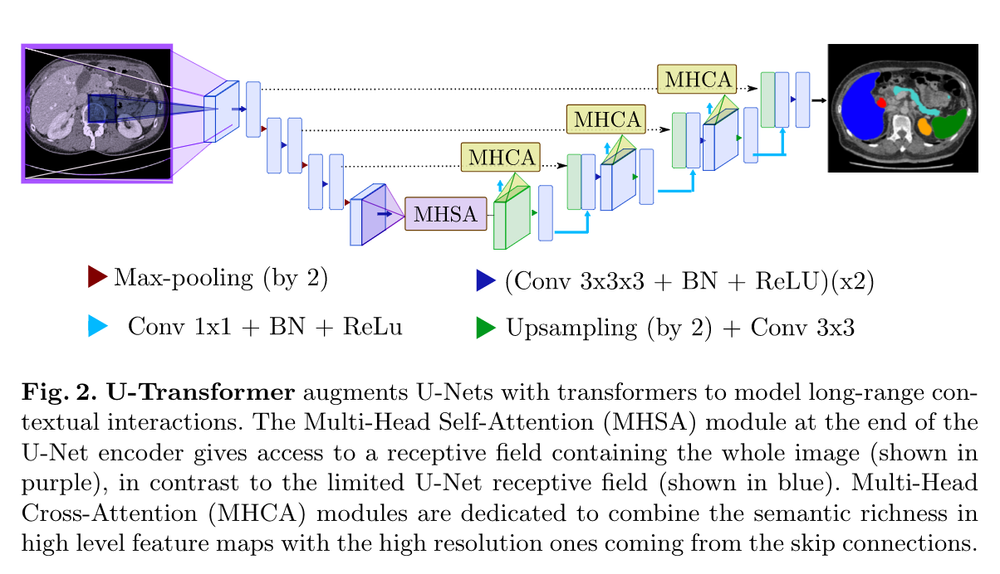
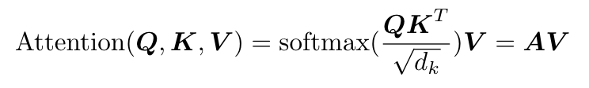
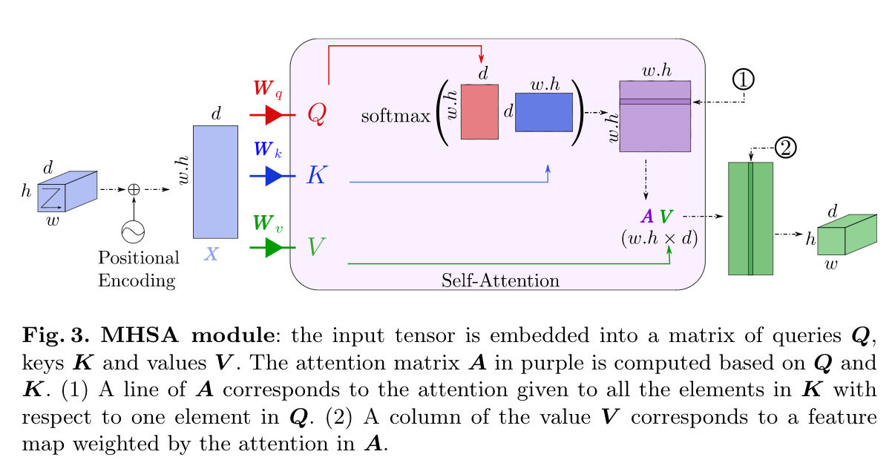
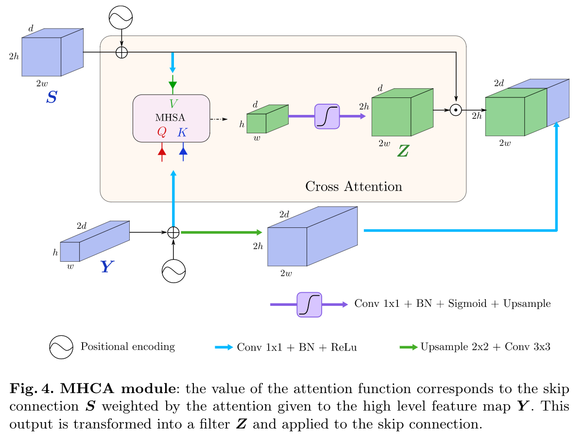

# U-Net Transformer: Self and Cross Attention forMedical Image Segmentation

Code 未开源

## 一、摘要

​		对于复杂和低对比度的解剖结构，医学图像分割依然是一个特别具有挑战性的问题。本文中，我们提出了U-Transformer网络结构，它将用于医学图像分割的U形结构和Transformer中的自注意力机制和交叉注意力机制结合。U-Transformer克服了U-Net无法对长程上下文交互和空间依赖建模的问题，这对于在具有挑战性的上下文中进行精确分割至关重要。为此，注意力机制包含在两个主要层面：自注意力模块利用编码器特征之间的全局交互，跳跃连接中的交叉注意力通过过滤到非语义特征在U-Net解码器中实现了良好的空间恢复。在两个腹部CT图像数据集上的实验表明，与U-Net和局部注意U-Net相比，U-Transformer带来了较大的性能增益。我们还强调了使用自我和交叉注意的重要性，以及U-Transformer带来的良好的可解释性特性。

## 二、模型结构

​		U-Transformer通过使用两种类型的注意模块：多头自我注意（MHSA）和多头交叉注意（MHCA），对长范围的上下文交互和空间依赖性进行建模。

​		这两个模块的设计都是基于输入在第一种情况下的自我关注或在第二种情况下对更高层次特征的关注来表达输入的新表示。

### 2.1 MHSA

​		MHSA模块用于从图像中提取远程结构信息。为此，它由《Attention is all you need》中所述的位于U形网络底部的多头自我注意功能组成，MHSA 的主要目标是将最高特征图中的每个元素相互连接，从而访问包含所有输入图像的感受野。Self-Attention的公式如下：

​		为了考虑绝对上下文信息，在输入特征中添加了位置编码。它特别适用于医学图像分割，其中不同的解剖结构遵循固定的空间位置。因此，可以利用位置编码捕获MHSA中器官之间的绝对和相对位置。

### 2.2 MHCA

注意力机制还可用于提高U-Net中解码器的效率，特别是可以增强通过跳跃连接传递过来的低层的特征图。事实上，如果这些跳过连接确保保留高分辨率信息，它们就缺乏可以在更深层次的网络中找到的更丰富的语义信息。

MHCA模块背后的理念就是从跳跃连接中关闭不相关的或噪音区域，并凸显出感兴趣区域。下图为MHCA模块，它被设计成了一个门控注意力的形式。

## 三、总结

本文介绍了U-Transformer，提出使用自我和交叉注意模块来模拟远程交互和空间依赖。未来的工作可能包括研究3D模型中的U-Transformer，以及其他模式，如MRI或US图像，以及其他医学图像任务。

