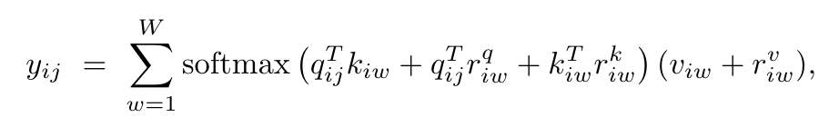
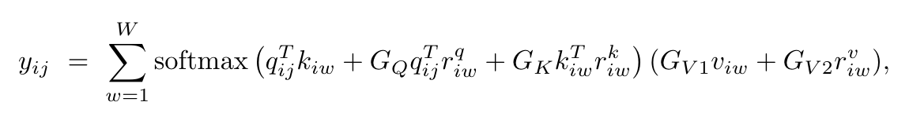

# Medical Transformer: Gated Axial-Attention forMedical Image Segmentation

[Code](https://github.com/jeya-maria-jose/Medical-Transformer)在卷积网络和三种不同数据集上的完全关注体系结构上成功地提高了医学图像分割任务的性能。

<extoc></extoc>

## 一、摘要

​		在过去的十年中，深度卷积神经网络被广泛应用于医学图像分割，并取得了良好的效果。但是卷积结构中存在固有的感应偏差，它们缺乏对图像中长程相关性的理解。最近提出的基于transformer的体系结构利用自我注意机制对长范围依赖项进行编码，并学习具有高度表达能力的表示。这促使我们探索基于transformer的解决方案，并研究将基于变压器的网络体系结构用于医学图像分割任务的可行性。但是对于计算机视觉方向提出的基于Transformer的网络结构大多数都需要大规模的数据集，但是目前医学图像数据样本的数量相对较低，因此很难训练出有效的基于Transformer的模型。

​		为了解决上述问题，本文提出了一个门控轴向注意力(Gated axial-attention)模型。该模型通过在Self-Attention模块中引入额外的控制机制来扩展现有的体系结构。此外，为了在医学图像上有效的训练模型，我们提出了一种局部-全局训练策略(LoGo)，进一步提高了性能，我们对整个图像和各个patch进行操作，分别学习局部和全局的特征。

本文内容：

1) 提出了一种选通位置敏感轴向注意机制，即使在较小的数据集上也能很好地工作。
2) 引入了基于Transformer的局部-全局（LoGo）训练方法，并证明该方法是有效的。
3) 提出了Medical Transformer（MedT），该Transformer基于上述两个专门为医学图像分割提出的概念。
4) 三种不同数据集上成功地提高了医学图像分割任务的性能。

## 二、内容

### 2.1 Self-Attention概述

Self-Attention是从NLP中借鉴过来的思想，因此仍然保留了Query、Key和Value等名称，它的基本结构如下：

它从上到下分为三个分支，分别为query、key和value。计算时通常分为三步：

- 第一步是将query和每个key进行相似度计算得到权重，常用的相似度函数有点积，拼接和感知机等。
- 第二步一般是用一个softmax函数对这些权重进行一些归一化；
- 第三步将权重和相应的key-value进行加权求和得到最后的attention map。

> Self-Attention相关博客：
>
> - https://blog.csdn.net/qq_37935516/article/details/104123018

与卷积不同，Self-Attention可以从feature map中获取非局部的信息，

### 2.2 Axial-Attention

为了克服计算相似性时的计算复杂度，我们将一个self-attention分解为两个self-attention子模块，第一个self-attention子模块在高度方向上进行self-attention，第二个self-attention子模块在宽度方向上进行self-attention，这被称为Axial-Attention。为了通过Self-attention计算相似性时添加位置偏差，我们添加了偏置项，使相似性对位置信息敏感，这个偏置项通常被称为相对位置编码。这些位置编码信息通常是可以被训练的，并且已经证明了其具有编码图像空间结构的能力。

对于任何给定的特征图x，带有位置编码和宽度轴向self-atttention的自注意力机制可以用以下方式表示：

### 2.3 Gate Axial-Attention

为了解决小规模数据集，位置偏差难学习的问题，我们提出了一种能够控制位置偏差对非局部上下文编码的影响的修正双轴注意块。

将我们提出的修改放到宽度轴向注意力中可以用以下方式表示：

其中GQ, GK, GV1, GV2都是可学习的参数，它们创建了一个门控机制，控制学习到的相对位置编码对编码非局部上下文的影响。通常，如果准确地学习了相对位置编码，则与未准确学习的编码相比，选通机制将为其分配较高的权重。

### 2.4 Local-Global Training

很显然，将图片切分成patch在transformer中训练的速度更快，但是在各个patch上进行单独的训练不能够完成医学图像分割的任务，它限制了网络学习各个位置关系的相关性。为了提高对图像的整体理解，我们提出在模型中使用两个分支，一个是处理图像原始分辨率的全局分支，另一个是处理图像patch的局部分支。

