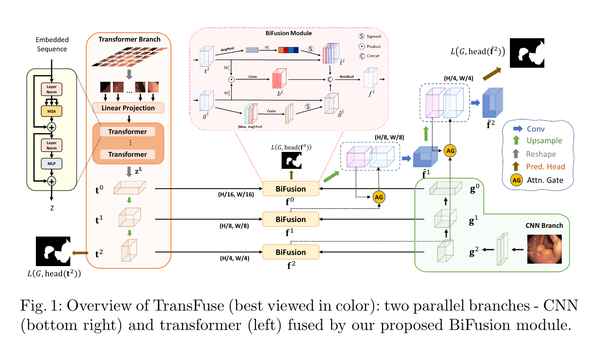
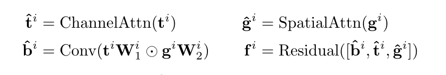

# TransFuse: Fusing Transformers and CNNs forMedical Image Segmentation

<extoc></extoc>

## 一、摘要

​		医学图像分割是开发医疗保健系统（尤其是疾病诊断和治疗计划）的必要先决条件。在各种医学图像分割任务中，U形架构（也称为U-Net）已成为事实上的标准，并取得了巨大的成功。但是，由于卷积运算的固有局部性，U-Net通常在明确建模远程依赖关系方面显示出局限性。我们提出了一种新的并行分支体系结构TransFuse来提高建模全局上下文的效率，同时保持对低级细节的有力把握。TransFuse以并行的方式将Transformer与CNN结合，可以以更浅的方式有效地捕获全局依赖性和低级空间细节。除此之外，本文还提出了一种新的融合技术BiFusion Module，以有效地融合来自两个分支的多层次特征。

## 二、引言

​		尽管CNN在医学图像分割任务中取得了巨大成功，但它在获取全局背景信息方面仍然缺乏效率。Transformer擅长建模全局上下文信息，但是在捕获细粒度细节方面存在局限性，尤其是在医学图像方面。为了结合CNN和Transformer两者的好处，有人提出了TransUnet，它利用CNN提取低级特征，然后通过Transformer模拟全局交互。过去的方式大多数都是通过用Transformer来替换卷积层，或者以顺序的方式堆叠两者，为了进一步发挥CNN加Transformer在医学图像分割中的作用，本文提出了一种不同的结构——TransFuse。它并行运行基于浅层CNN的编码器和基于Transformer的分割网络，后面接着我们提出的一个BiFusion模块，它能够将来自两个分支的特征融合在一起共同进行预测。TransFuse有以下几个特征：

1. 可以有效地捕捉低层次的空间特征和高层次的语义语境；
2. 它不需要很深的网络，这缓解了梯度消失和特征减少的重用问题；
3. 它有效的减少了模型的大小并提高了推理的速度。

## 三、方法

如图所示，TransFuse包含两个并行的分支来分别处理不同的信息。

1. CNN分支：逐渐增加感受野，对从局部到全局的特征进行编码；
2. Transformer分支：它以全局自我关注的方式启动，并在最后恢复本地详细信息。

从两个分支中提取的具有相同分辨率的特征被输入到我们提出的BiFusion中，在BiFusion模块中应用self-Attention和双线性Hadamard的乘积来选择性的融合信息。然后将多层次的特征映射进行组合，使用选通跳跃连接生成分割结果。并行分支方法有两个主要优点：首先，通过充分利用CNN和Transformers的优点，我们认为，在保持对低层上下文的敏感性的同时，传输可以捕获全局信息，而无需构建非常深的网络；其次，我们提出的BiFusion模块可以在特征提取过程中同时利用CNN和变压器的不同特性，从而使融合表示功能强大且紧凑。

CNN分支和Transformer分支不详细罗列，与其他论文中相同。

BiFusion Module：

混合特征由以下方式来实现：

通道注意力用SE块来实现，空间注意力用CBAM块来实现。

损失函数使用IOU损失和BCE损失的加权和，其中BCE损失的权重更高。

## 四、总结

​		在本文中我们提出了一种新的融合CNN和Transformer的策略，最终的体系结构TransFuse利用了CNN在建模空间相关性方面的感应偏差和Transformers在建模全局关系方面的强大能力。在参数和推理速度方面都非常高效。在未来计划i高Transformer层的效率，并在其他医疗相关任务中进行测试。

