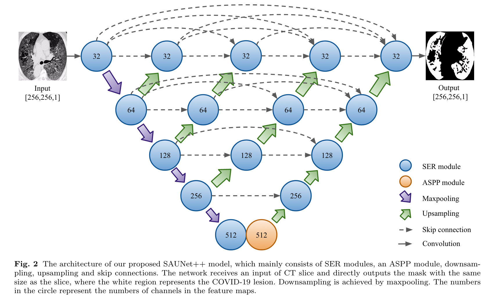
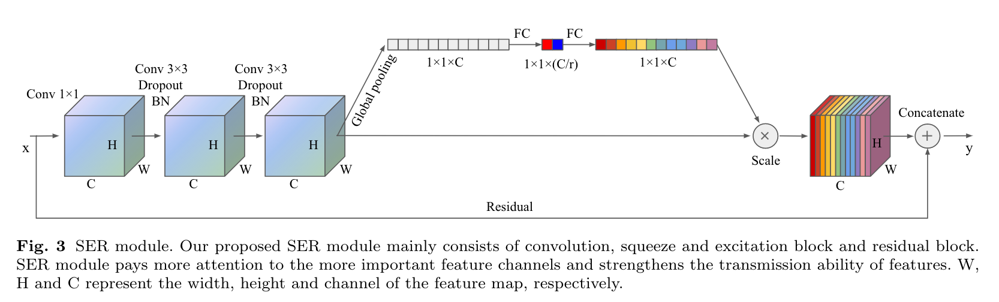
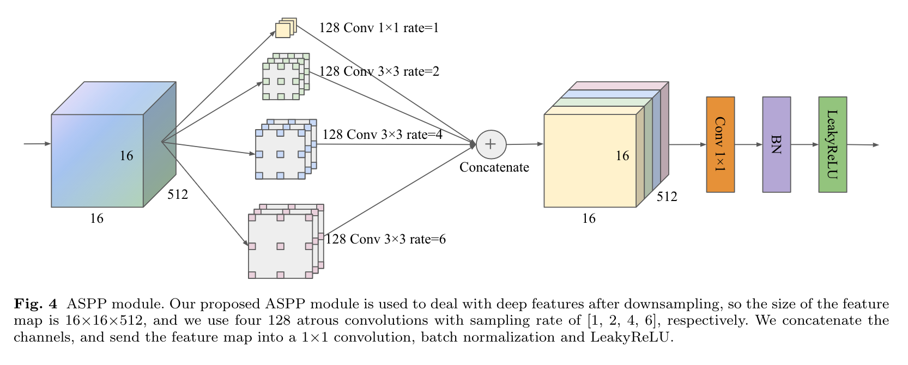
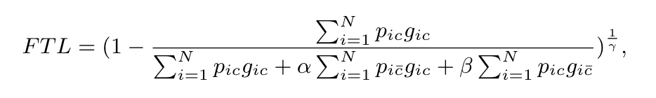
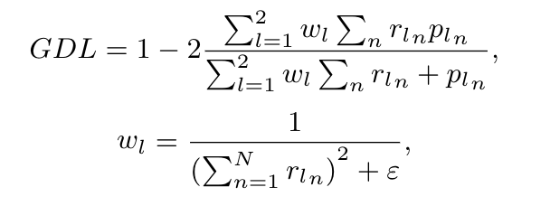

# SAUNet++: An automatic segmentation model of COVID-19 lesion from CT slices

<extoc></extoc>

## 一、摘要

​		2019年冠状病毒病（COVID-19）疫情已在世界范围内蔓延，医疗体系陷入危机。计算机断层扫描（CT）图像中COVID-19病变的精确、自动化和快速分割可帮助医生诊断并提供预后信息。然而，病变的多样性和早期病变的小区域使其分割复杂化。为了解决这些问题，我们提出了一个新的SAUNet++模型，该模型包含SER模块和ASPP模块。SER模块可以为更重要的信道分配更多的权重，缓解梯度消失的问题，ASPP模块可以使用不同的采样率通过空洞卷积获得上下文信息。此外，GDL可以降低病变大小与Dice损失之间的相关性，并被引入到解决小区域分割问题中。我们收集了来自中国、意大利和俄罗斯的多国CT扫描数据，并进行了广泛的实验。在实验中，SAUNet++ 和GDL分别与先进的分割模型和流行的损失函数进行了比较。实验结果表明，我们的方法可以有效地提高COVID-19病灶分割在Dice系数（我们的87.38%对U-NET++：86.08%），灵敏度（我们：93.28%对U-NET++：89.85%）和Hausdorff距离（我们：19.99 mm vs U-NET++：27.69mm）的准确性。

## 二、引言

​		近年来，基于深度学习的医学图像分割模型在辅助人类疾病诊断方面取得了令人满意的效果。2019冠状病毒疾病的分割仍存在以下问题。

1. 病灶类型的多样性，病灶之间在纹理、位置、形状等特征上存在较大差异，增加了分割的难度。

2. 2019冠状病毒疾病早期发现小面积，早期发现COVID-19患者有利于后续治疗，但早期GGO因其面积小、对比度低、外观模糊而难以识别。

3. 2019冠状病毒疾病的数据集缺乏，这是一个挑战，收集足够的数据来训练分割模型，并且是昂贵和费时的，以获得高质量的像素级掩模。

   本文的主要贡献：

   - 在UNet++的基础上，引入了SER和ASPP模块。SER模块可以为更重要的通道分配更多的权重，并缓解梯度消失的问题，而ASPP模块可以使用不同的采样率通过空洞卷积获得上下文信息。

   - 引入GDL来解决小区域分割问题。与常见的骰子丢失相比，它可以平衡每个区域对丢失的贡献，使训练更加稳定。

   - 我们收集了来自四个不同数据集的多国CT扫描。实验共使用了11359张具有高质量素水平掩模的切片。

## 三、方法

SAUNet++体系结构如图所示，它在UNet和UNet++上进行改进，原始的UNet利用四个下采样获得高维信息，然后使用四个上采样将特征映射到原始大小，并使用四个跳跃连接合并特征映射。基于U-Net的改进方法并不总是使用四层结构，但是，下采样的组合，上采样和跳过连接保持不变。可以从不同深度的结构中提取不同的特征，这对分割都很重要，因此U-Net++将四种不同深度的结构结合起来，并使用不同长度的跳过连接。由于U-Net++使用无填充卷积，两次卷积后，同一层中的特征图的边界像素丢失，因此需要先裁剪收缩路径中的特征图，然后在展开路径中与特征图连接。为了增强U-Net++的结构，我们使用SER模块替换原来的两个卷积，并在下采样结束时添加ASPP模块。

### 3.1 SER

SER模块如图所示，SER模块基于SE块和残差块。

### 3.2 ASPP

​		卷积层和池化层的结合可以在不增加额外参数的情况下扩展图像的感受野，但池化操作会压缩图像的大小，从而丢失图像的细节。然而，上采样无法恢复所有空间信息。空洞卷积用更大的感受野覆盖图像，只有感受野中的一些像素用于卷积，这相当于在卷积核中插入孔。因此，空洞卷积可以扩展感受野，并在不丢失细节的情况下控制特征图的分辨率。

### 3.3 Loss

Dice损失被广泛用于指导图像分割模型的训练，但在面对小区域时分割性能较差。如果图像中的像素数和背景中的像素数之间存在极端不平衡，一旦一小部分像素预测错误，就会导致Dice 损失的急剧变化，导致训练不稳定。

Abraham等人提出了focal tversky loss (FTL)来处理像素数的不平衡问题。

Sudre等人提出GDL使用与病变成反比的权重，以便更好地分割小区域：

## 四、总结

SAUNet++性能超过了最先进的医学图像分割模型。我们的模型也可用于分割其他肺部疾病，如普通肺炎。在未来的工作中，我们将把病变分成不同的类别来评估所提出的多类分割方法。
