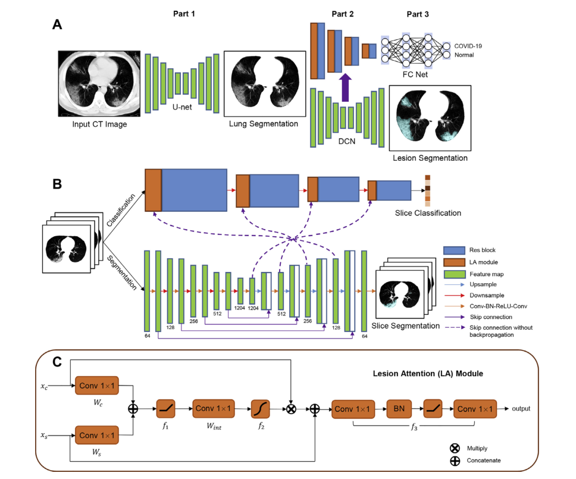
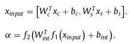

# Dual-branch combination network (DCN): Towards accurate diagnosis and lesion  segmentation of COVID-19 using CT images

## 一、摘要

**期刊：Medical Image Analysis —— 一区**

​	最近，COVID-19在全球爆发和传播，在医疗资源日益紧张的情况下，开发准确和有效的诊断工具势在必行。人工智能辅助工具展现出令人满意的潜力，如，人们已经证明胸部CT图像在COVID-19的诊断和评估中能够发挥重要作用。然而，开发基于CT图像的AI诊断系统用于疾病检测面临着相当大的挑战，这主要是应为缺乏足够人工标注的样本来供模型进行训练，以及对于早期感染阶段的细微病变不够敏感。在本研究中，我们开发了一种用于COVID-19诊断的双分支组合网络(DCN)，该网络可以同时实现个体级分类和病变分割。为了将分类分支更集中于病变区域，我们开发了一种新的病变注意模块来整合中间分割结果。此外，为了管理不同成像参数对个体设备的潜在影响，提出了一种切片概率映射方法来学习从切片级到个体级分类的转换。我们在国内10 个研究机构的1202个课题的大数据集上进行了实验，结果表明：

	1. 该模型在内部数据集上的分类准确率为96.74%，在外部验证数据集上的分类准确率为92.87%，优于其他模型。
	2. DCN在样本较少的情况下具有相当的性能和较高的灵敏度，尤其是在针对细微病变的检测中更为明显。
	3. 与其他深度学习模型相比，DCN基于高级语义信息进行分类，对感染位点具有较好的解释性。

基于我们提出的框架的COVID-19在线CT诊断平台现已可用。

## 二、引言

​	自2020年初以来，新型冠状病毒(COVID-19)在全球爆发并迅速传播。2020年3月1日，世界卫生组织(WHO)宣布该疾病位大流行疾病。根据世界卫生组织公布的实时数据，截至2020年8月8日，已有1900多万人感染了这中疾病，71.6万多名受害者死于这种疾病。毫无疑问，这一流行病已经称为对全球人口的严峻挑战。因此，准确有效的诊断该疾病是当务之急。

​	逆转录聚合酶链反应(RT-PCR)检测目前被认为是COVID-19诊断的金标准，但是它耗时长，假阴性率高。胸部CT图像作为一种补充在实践中对COVID-19诊断更为敏感和高效，已被广泛应用于疾病的早期筛查。以往的研究表明，可以通过CT图像评估病变的大小和严重程度，以帮助评估疾病进展和后续治疗。因此，CT在中国的“COVID-19治疗计划(试验版本7)”中被确认为COVID-19的诊断标准。然而，手工评估CT图像通常需要几个小时，考虑到众多疑似和确诊病例的效率要求，这在COVID-19临床诊断中是不可接受的。因此开发AI辅助CT诊断系统对COVID-19病例的快速诊断和准确评估至关重要。

​	在过去的十年中，我们见证了深度学习的出现，它已经被证明在计算机视觉和模式识别方面具有相对优势。AlexNet和VGGNet等分类模型使用一系列级联卷积模块提取特征用于图像分类。ResNet为卷积神经网络引入了shortcut，缓解了梯度消失问题。DenseNet利用每两层之间的跳跃式连接，用级联操作代替求和，使信息更容易流动。在图像分割领域，Long等人使用了完全卷积网络进行图像分割，提出了深度学习在图像分割任务中的应用。随后人们又提出了DeepLab、PSPNet、U-Net等几种深度分割网络，进一步提高了图像分割性能。其中，U-Net结构简单，易于训练，在医学图像分割中得到了广泛的应用，因此，我们在本次研究中使用了它。

​	到目前为止，大多数的研究都是分别进行分类和分割。事实上，这两项任务可以结合起来实现更好的性能。CT图像中的病变在COVID-19筛查中具有决定性作用，但病变的大小在疾病早期通常较小，可能被分类网络忽略。然而，来自分割网络的中间结果可能有助于通过注意力机制将分类网络更集中在病灶上，以便准确推断。此外，注意力特征图可以揭示对分类至关重要的区域，从而提高深度学习模型的可解释性，并协助临床医生进行进一步评估。因此，结合分类和分割任务可以提高性能。

​	在本研究中，我们提出了一个结合分割和分类的框架，同事完成COVID-19诊断和基于胸部CT图像的病灶分割。首先采用基于U-Net的肺分割方法来描绘肺轮廓。然后，采用双分支组合网络(DCN)进行片级分割和分类。我们在DCN中提出了一个病变注意力机制(Lesion Attention, LA)，利用分割和分类分支的中间结果来提高分类性能。最后采用切片概率映射策略和全连接网络(FCN)从切片结果中获得个体级结果，使该方法适用于不同切片数的CT扫描。通过与其他模型的性能比较，证明了DCN在图像分类方面的有效性。此外，我们发现该方法对小病变区域图像的分类更加敏感。这对于COVID-19的早期诊断非常有帮助，因为早期病变通常很细微，很难发现。

​	本文的主要贡献如下：

1. 利用DCN同时实现了COVID-19的分割和分类，并提出了一种加权Dice损失，以确保网络的可训练性。
2. 对COVID-19的敏感性明显提高，特别是对细微病变。
3. 由LA模块生成的中间注意图为分类提供了可解释性。

## 三、模型

​	本文方法的总体框架可分为三部分，第一部分是基于UNet的肺分割网络，提取准确的肺区域，第二部分是提出的DCN模型，它可以利用提出的LA模块同时完成CT图像的切片级分类和分割。在第三部分中，将切片结果与切片概率映射方法相结合，利用三层全连通网络获得个体层次上的分类结果。

### 3.1 肺分割

​	对图像进行处理，消除干扰，得到感兴趣区域，及肺。使用基于HU值的阈值方法来进行胸部CT图像的预处理。这些阈值方法在实际应用中不够准确，特别是对COVID-19患者的CT图像来说。一种可能的解释是患者病灶的HU值较高，使用阈值法难以与其他器官区分，因此影响后续分析。因此我们训练了一种基于UNet的肺分割模型。

### 3.2 DCN

​	本文提出了DCN来同时完成CT图像的分类和分割。该网络由分类分支和分割分支组成，分别对应于分类任务和分割任务。分类分支的主干为ResNet-50，包括4个残差块。分割分支的主干是U-Net，包括编码器和解码器。DCN接收肺分割后的图像作为输入，输出切片级分类和分割结果。

#### 3.2.1 LA

​	为了更好的整合两个分支的信息，提高分类性能，本文提出了LA模块。LA模块的输入包含两个部分，来自分支的Xc和来自分割分支的Xs。利用关注机制，将分类分支更多地几种在病变上。LA模块的计算公式如下：

其中Wc、Ws是表示1×1卷积层的权重，bc、bs、bint表示一个相应的偏差。f1(x)=max(x, 0)，f2(x)=1/(1+exp(-x))分别对应ReLU和Sigmoid激活函数。注意力图归一化到[0, 1]。LA模块的最终输出可以如下表示：

)

f3包含一系列的单元：1×1的卷积、BN和一个ReLU激活函数。

### 3.3 切片概率映射

​	DCN处理每个切片的分类，然后我们需要结合切片结果，实现个体级分类，并且确定受试者是否感染了COVID-19。然而，由于切片厚度、视野或肺体积的不同，切片数在不同的受试者中也不同。一些研究在全连接层上使用最大或平均赤化来消除这个问题。但是者可能会导致信息的丢失，因为该方法只保存所有片的最大或平均值。为了最大限度的获取每个切片信息，提出了一种基于重采样的切片概率映射策略。具体来说，我们将切片的结果按降序排序，使用双线性插值方法拟合曲线。然后我们在相同的区间内从曲线中获得100个值，并按降序获得连续概率。然后将一个简单的三层FCN应用于个体分类，并将导出的100个值作为输入。两个隐藏层的节点数分别为256和128。

### 3.4 损失函数

​	在分类分支中使用交叉熵损失函数

​	原始的UNet使用BCE损失函数，在我们的数据集上表现很差，COVID-19患者CT图像分割数据极不平衡，病灶区域通常比正常区域和北京小得多，BCE损失不适合这种情况。为了解决这个问题，我们使用Dice损失函数，切片级的Dice损失可以表示如下：

​	训练分类分支需要来自正常受试者的样本。而在分割任务重，正常受试者的图像都是负样本，这样就加剧了样本的不平衡，从而影响了分支的训练，为了解决这个问题，提出一种加权的Dice损失函数用于分割分支。

​	将带病变和不带病变的权重设置为1和0，即只有带标注病变的切片参与分割分支的反向传播。总的损失函数表示如下：

​	其中λ为两种损耗的权衡参数，我们在实验中设置λ为1。

## 四、实验和结果

​	本文使用内部数据集进行训练和验证，采用五折交叉验证策略，利用外部验证集评价模型的泛化性能。像素值代表-900HU到100HU窗口内的HU值，它们被进一步归一化到0到255。

​	该方法在内部数据集上准确率为96.74%，AUC为0.9864。在大型的外部数据集上验证了该方法的泛化性能，准确率为92.87%。实验表明，DCN模型在内部和外部数据集上都优于其他物种常用的分类模型。此外，我们还讲DCN与其他两种COVID-19分类方法进行了比较，发现DCN具有更好的新能。提出的DCN实现了99.1%的肺分割DSC和83.51%的病变分割DSC。

​	提出了一个LA模块，融合了分割分支和分类分支的中间结果，以提高性能。将两个分支的中间结果连接起来，生成用于图像分类的注意力图，这样，分类分支就可以更多的几种在感染点位上。进行了一些消融研究，证明了LA块的有效性。显著提高了准确率。

​	后续工作为将DCN扩展到更广泛的应用领域，如肺结节分类和肿瘤检测。

